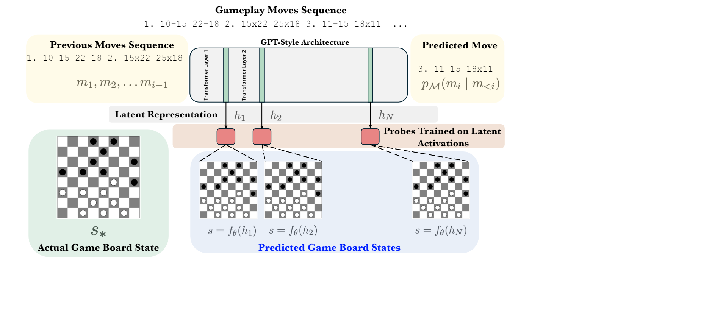

## CheckersGPT

**Picture:** *CheckersGPT Model Architecture*

This repository contains the official Pytorch implementation of the following paper:
> **CheckersGPT: Learning World Models through Language Modeling** 

> **Authors:** Abhinav Joshi, Vaibhav Sharma, Ashutosh Modi 
>
> **Abstract:** *Although Large Language Models (LLMs) have been trained using just the next token prediction objective, these have shown impressive performance on various tasks. Consequently, it has attracted research interests in this regard. While one line of work in the past has suggested that LLMs learn surface-level statistics from the dataset, another line of work emphasizes that the learned representations are effective for simulating the underlying world model, considering the causal relationship for the next token prediction. This phenomenon is often referred to as the emergence of a world model in sequence prediction tasks. Recent work has demonstrated this phenomenon in a simulated setting of board games like Othello and Chess. In this paper, we analyze the game of Checkers to find out the emergence of a world model in a language model. By training a GPT-style autoregressive language model using only the next character prediction objective, we find that the model does learn a world model representation of the board positions. We perform our analysis on two datasets: 1) from human gameplay and 2) synthetic, which comes from the checkers game tree. With multiple models trained with different layer sizes, we find that increasing the parameter size does help learn better world model representation decoded by linear probes.*

The codebase is taken from nanoGPT(https://github.com/karpathy/nanoGPT) for training the GPT style model and chess_llm_interpretability(https://github.com/adamkarvonen/chess_llm_interpretability) for training the linear probes.
nanoGPT is used for training the GPT model on the PDN(Portable Draught Notation) strings of Checkers game, and the chess_llm_interpretability is used for training the linear probles on the layers of the GPT model.

## Requirements
    Create a python environment with version 3.11
    pip install torch numpy transformers datasets tiktoken wandb tqdm
    pip install -r chess_llm_interpretability/requirements.txt
    wandb login xxxx # xxxx = auth token, find it at wandb.ai/authorize Otherwise, send wandb_logging to False

## Preparing datasets for training
    Human played games (Human dataset)
    python prepare.py

    OR 

    Synthetic games(Synthetic dataset)
    #First generate the synthetic data using :
    cd checkersengine/checkers
    python synthetic_paralleldatagetn.py
    python merge_syntheticdata.py

    #Come back to the root folder 
    cd..
    python preparesynthetic.py

Synthetic Data will have a vocab of 16 instead of 17 , so we need to change the vocab size appropriately.No need to change the vocab if training on the human dataset.

## Training model
    python train.py train_checkers_char.py     #Check the train.py file to train on multiple GPUs

## Sampling model
    python sample.py

Once the Model gets trained move the CheckersHuman.pt from the out-checkers-char folder and meta.pkl from data/checkers_games to chess_llm_interpretability/models folder.

## Train probes using the Chess_llm_interpretability
    cd chess_llm_interpretability
    Refer chess_llm_interpretability Readme for training the probe.

